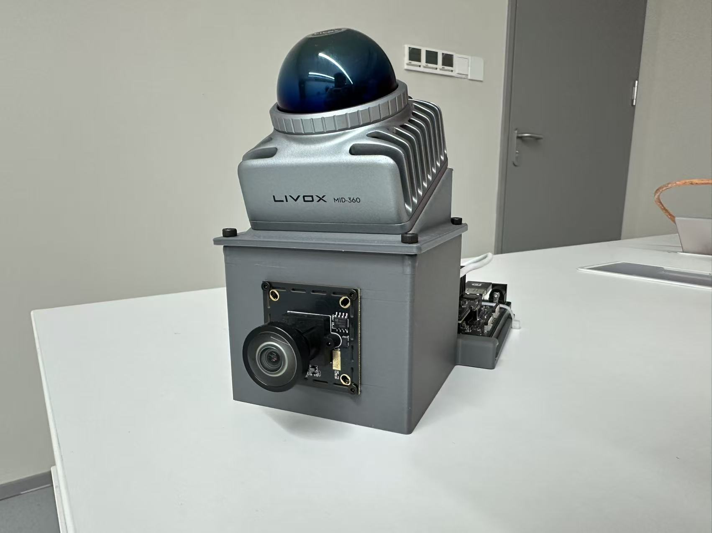
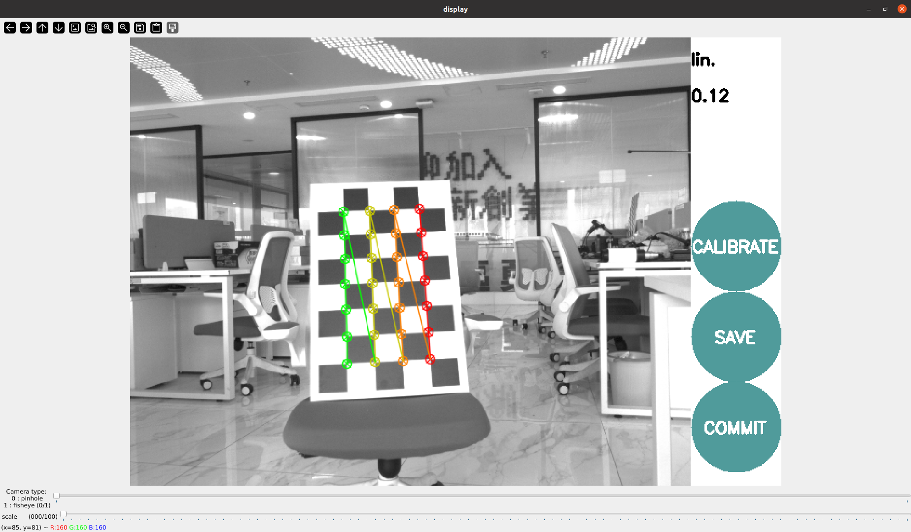
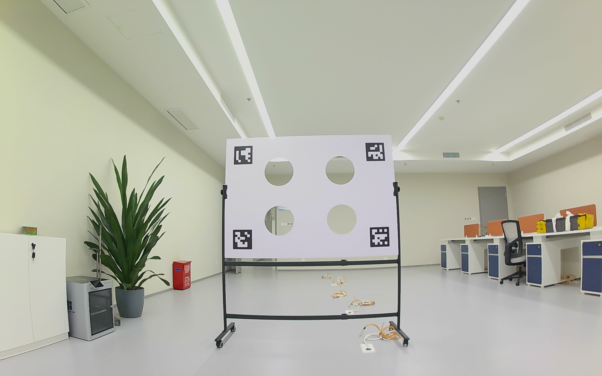
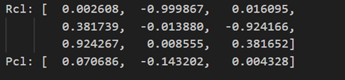

# 🚀 FastLIVO2 复现说明

## 🧭 概述

本说明针对 **FastLIVO2** 的复现与配置。文档包含：

* 🧰 硬件平台搭建
* ⚙️ 驱动与 SDK 安装
* 🧩 联合标定
* 🎥 数据录制
* 🪄 参数调整

## 🧱 硬件平台

| 模块      | 型号 / 参数        | 备注        |
| ------- | -------------- | --------- |
| 📸 相机   | 外部触发单目（鱼眼）     | 10 Hz     |
| 🌈 雷达   | Livox Mid360   | 1 Hz      |
| 💻 计算平台 | Jetson Orin NX |     |
| ⚡ 硬同步   | STM32F103      | 负责相机与雷达触发 |

> 💡 建议 Mid360 略向下倾斜安装以更好匹配相机视角。

📷 整体架构图：


## 🔌 硬件连接与搭建

* 相机与雷达需外部触发
* 将相机背部同步线及雷达同步线接入单片机对应引脚。
* 雷达线序可查官网，若不确定可用万用表蜂鸣档检测线序。
* 相机设置：关闭自动曝光，手动设置曝光值。

🧩 硬件同步逻辑图：


## 🧠 代码与依赖

* Camera 驱动已适配 OpenCV 4.6，可直接编译。
* Livox SDK & driver：

  * [Livox-SDK2](https://github.com/Livox-SDK/Livox-SDK2)
  * [livox_ros_driver2](https://github.com/Livox-SDK/livox_ros_driver2)
* FAST-LIVO2 源码：

  * [FAST-LIVO2](https://github.com/hku-mars/FAST-LIVO2)
* FAST-Calib 联合标定工具：

  * [FAST-Calib](https://github.com/hku-mars/FAST-Calib)

⚙️ 编译完成后运行fastlivo2，在 RViz 中查看点云与图像同步效果。

## 🎯 联合标定（FAST-Calib）

### 准备步骤

1. 获取相机内参。
2. 安装标定功能包：

```bash
sudo apt install ros-$ROS_DISTRO-camera-calibration
```

3. 准备标定板，启动相机节点。

### 启动标定工具

```bash
rosrun camera_calibration cameracalibrator.py --size 7x4 --square 0.8 image:=/<your_camera_topic>
```

📌 注意事项：

* 拍摄时间不宜过长
* 帧率不宜过高
* 样本数建议 ≤ 100 张

📷 标定示意图：


得到内参后填入以下文件：

* `/FAST-LIVO2/config/camera_self.yaml`
* `/FAST-Calib/config/qr_params.yaml`

### 📦 录制数据包（FAST-Calib 使用）

录制要求：

* 使用rqt保存一张图片 + 一个 rosbag（录制时保持静止）
📷 示意图：


* 放入 `/FAST-Calib/calib_data` 目录
* 确保文件名与`/FAST-Calib/launch/calib.launch`中的文件名一致

🎬 启动命令：

```bash
roslaunch fast_calib calib.launch
```

输出结果路径：

```
FAST-Calib/output/single_calib_result.txt
```
示意图：


将结果填入 `/FAST-LIVO2/config/MID360.yaml`

## ⚙️ 关键参数说明（YAML 示例）

```yaml
time_offset:    #时间同步部分，几乎不要，也建议不要改        
  imu_time_offset: 0.0
  img_time_offset: 0.1
  exposure_time_init: 0.0

preprocess:
  point_filter_num: 1   #点云预处理滤波次数，建议不要改
  filter_size_surf: 0.1 #点云体素滤波大小，影响点云稠密度与处理速度 ，增大会丢失细节，0.1是一个比较合适的值
  lidar_type: 1
  scan_line: 4  #如果是mid360则设置为4，不要改！
  blind: 0.5    #雷达盲区距离，小于该距离的点被丢弃

vio:
  max_iterations: 5 #光视觉里程计最大迭代次数，增大可能提升精度但会降低速度
  outlier_threshold: 1000   # 100 1000 越大表示不太信任图像测量
  img_point_cov: 100    # 100 1000 越大表示不太信任图像测量
  patch_size: 8 #更大的 patch/能提高匹配稳定性与稠密性
  patch_pyrimid_level: 4
  normal_en: true   #是否使用法线辅助，建议开启
  raycast_en: true  #是否使用光线投射辅助，建议开启
  inverse_composition_en: false #是否使用逆向合成，建议关闭，开启的话，位置更新会变慢
  exposure_estimate_en: true    #是否估计曝光时间，建议开启
  inv_expo_cov: 0.1 #曝光时间协方差，越大表示不太信任图像测量

imu:    #IMU参数几乎不需要改
  imu_en: true  #是否使用IMU，建议开启
  imu_int_frame: 30 #每隔多少帧进行一次IMU预积分，建议不用改
  acc_cov: 0.5
  gyr_cov: 0.3
  b_acc_cov: 0.0001
  b_gyr_cov: 0.0001

lio:
  max_iterations: 5 #激光里程计最大迭代次数，增大可能提升精度但会降低速度
  dept_err: 0.01
  beam_err: 0.10
  min_eigen_value: 0.005    #点云平面判定阈值，减小会有更多特征点参与，但噪声可能增加
  voxel_size: 0.5   #体素大小（m），是最直接影响地图分辨率的参数
  max_layer: 2  #体素最大层级，一般不需要改
  max_points_num: 50    #每个体素最大点数，防止内存爆炸
  layer_init_num: [5, 5, 5, 5, 5]

local_map:  #是否启用局部地图滑动
  map_sliding_en: false
  half_map_size: 100
  sliding_thresh: 8

uav:
  imu_rate_odom: false   #是否以 IMU 频率发布里程计
  gravity_align_en: true    #是否进行重力对齐，建议开启

publish:
  dense_map_en: true    #是否发布稠密点云地图
  pub_effect_point_en: false    #是否发布有效点云（可用于调试匹配效果）
  pub_plane_en: false   #是否发布点云平面（可用于调试点云特征提取效果）
  pub_scan_num: 1   #每隔多少帧发布一次点云地图
  blind_rgb_points: 0.0 #RGB点云盲区距离，小于该距离的点不发布

pcd_save:
  pcd_save_en: true #是否保存点云文件
  colmap_output_en: false
  filter_size_pcd: 0.15 #保存点云体素滤波大小
  interval: -1
```

🧮 参数简要影响：

* 🕐 `time_offset`：不同步问题时才修改。
* 🎚️ `filter_size_surf`：越大，点云越稀疏。
* 🔁 `max_iterations`：越大精度高但耗时。
* 🧱 `voxel_size`：地图分辨率控制参数。
* ⚖️ `min_eigen_value`：影响特征匹配数量与噪声。

🎬 **FastLIVO2 运行演示视频**

<video width="640" height="360" controls>
  <source src="assets/demo.mp4" type="video/mp4">
</video>
